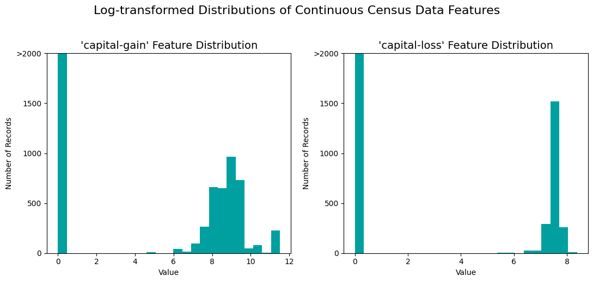
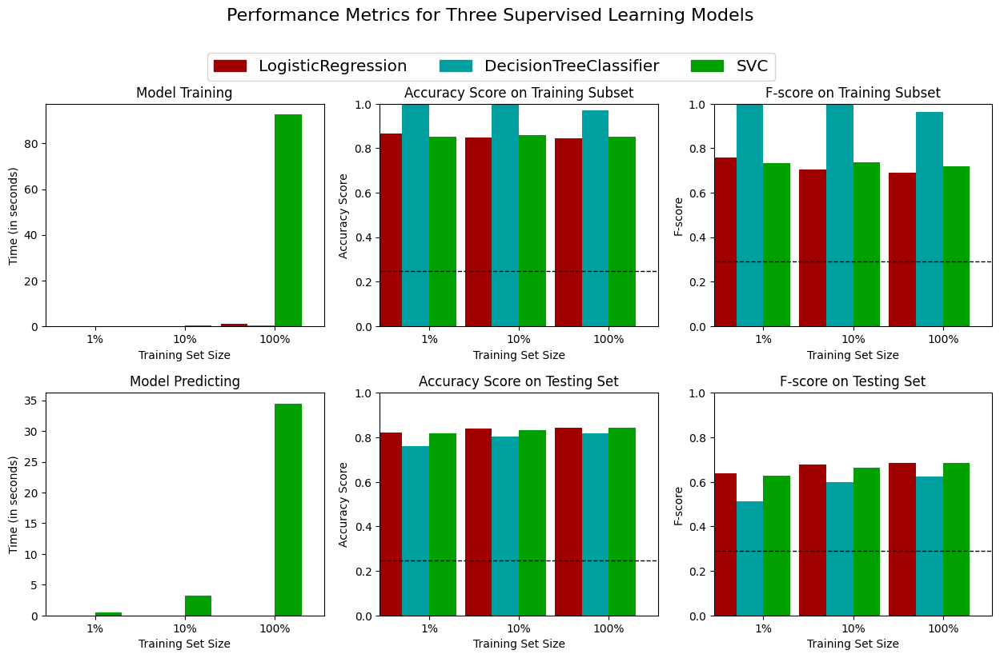
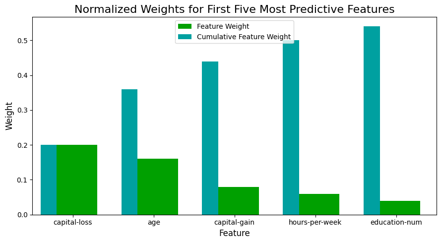

# Supervised Learning
## Project: Finding Donors for CharityML

### Install

This project requires **Python 3.x** and the following Python libraries installed:

- [NumPy](http://www.numpy.org/)
- [Pandas](http://pandas.pydata.org)
- [matplotlib](http://matplotlib.org/)
- [scikit-learn](http://scikit-learn.org/stable/)

You will also need to have software installed to run and execute an [iPython Notebook](http://ipython.org/notebook.html)

We recommend students install [Anaconda](https://www.continuum.io/downloads), a pre-packaged Python distribution that contains all of the necessary libraries and software for this project.

### Code

Template code is provided in the `finding_donors.ipynb` notebook file. You will also be required to use the included `visuals.py` Python file and the `census.csv` dataset file to complete your work. While some code has already been implemented to get you started, you will need to implement additional functionality when requested to successfully complete the project. Note that the code included in `visuals.py` is meant to be used out-of-the-box and not intended for students to manipulate. If you are interested in how the visualizations are created in the notebook, please feel free to explore this Python file.

### Run

In a terminal or command window, navigate to the top-level project directory `finding_donors/` (that contains this README) and run one of the following commands:

```bash
ipython notebook finding_donors.ipynb
```
or
```bash
jupyter notebook finding_donors.ipynb
```

This will open the iPython Notebook software and project file in your browser.

### Data

The modified census dataset consists of approximately 32,000 data points, with each datapoint having 13 features. This dataset is a modified version of the dataset published in the paper *"Scaling Up the Accuracy of Naive-Bayes Classifiers: a Decision-Tree Hybrid",* by Ron Kohavi. You may find this paper [online](https://www.aaai.org/Papers/KDD/1996/KDD96-033.pdf), with the original dataset hosted on [UCI](https://archive.ics.uci.edu/ml/datasets/Census+Income).

**Features**
- `age`: Age
- `workclass`: Working Class (Private, Self-emp-not-inc, Self-emp-inc, Federal-gov, Local-gov, State-gov, Without-pay, Never-worked)
- `education_level`: Level of Education (Bachelors, Some-college, 11th, HS-grad, Prof-school, Assoc-acdm, Assoc-voc, 9th, 7th-8th, 12th, Masters, 1st-4th, 10th, Doctorate, 5th-6th, Preschool)
- `education-num`: Number of educational years completed
- `marital-status`: Marital status (Married-civ-spouse, Divorced, Never-married, Separated, Widowed, Married-spouse-absent, Married-AF-spouse)
- `occupation`: Work Occupation (Tech-support, Craft-repair, Other-service, Sales, Exec-managerial, Prof-specialty, Handlers-cleaners, Machine-op-inspct, Adm-clerical, Farming-fishing, Transport-moving, Priv-house-serv, Protective-serv, Armed-Forces)
- `relationship`: Relationship Status (Wife, Own-child, Husband, Not-in-family, Other-relative, Unmarried)
- `race`: Race (White, Asian-Pac-Islander, Amer-Indian-Eskimo, Other, Black)
- `sex`: Sex (Female, Male)
- `capital-gain`: Monetary Capital Gains
- `capital-loss`: Monetary Capital Losses
- `hours-per-week`: Average Hours Per Week Worked
- `native-country`: Native Country (United-States, Cambodia, England, Puerto-Rico, Canada, Germany, Outlying-US(Guam-USVI-etc), India, Japan, Greece, South, China, Cuba, Iran, Honduras, Philippines, Italy, Poland, Jamaica, Vietnam, Mexico, Portugal, Ireland, France, Dominican-Republic, Laos, Ecuador, Taiwan, Haiti, Columbia, Hungary, Guatemala, Nicaragua, Scotland, Thailand, Yugoslavia, El-Salvador, Trinadad&Tobago, Peru, Hong, Holand-Netherlands)

**Target Variable**
- `income`: Income Class (<=50K, >50K)

### Visulization
1. Skew Distribution of `Capital Gain` and `Capital Loss`


2. Log Transformation of `Capital Gain` and `Capital Loss`


3. Result evaluation


4. Fine-tune model

|     Metric     | Unoptimized Model | Optimized Model |
| :------------: | :---------------: | :-------------: |
| Accuracy Score |      **0.8421**       |     0.8418      |
| F-score        |      **0.6837**       |     0.6829      |

5. Feature importance


6. Feature selection

|     Metric     | Feature Selection Model | Optimized Model |
| :------------: | :---------------: | :-------------: |
| Accuracy Score |      0.8057       |    **0.8418**      |
| F-score        |      0.5905       |    **0.6829**      |
