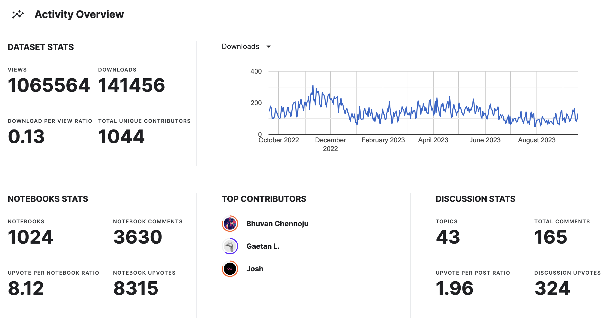

# Stroke Prediction

## Domain Background

According to the World Health Organization (WHO) stroke is the 2nd leading cause of death globally, responsible for approximately 11% of total deaths. It will be good if we detect and prevent this deadly disease in time, it will bring happiness to the sick and have more time to live.

## Problem Statement

Currently, classification methods using machine learning and deep learning have become popular to assist doctors in diagnosing stroke and providing timely treatment. Here, we use two models of machine learning to predict stroke based on the input parameters like gender, age, various diseases, and smoking status. The challenge of working with imbalanced datasets is that most machine learning techniques will ignore, and in turn have poor performance on, the minority class, although typically it is performance on the minority class that is most important.

## Datasets and Inputs

In this project, we will use the dataset provided by [Kaggle](https://www.kaggle.com/datasets/fedesoriano/stroke-prediction-dataset)

This dataset is used to predict whether a patient is likely to get stroke based on the input parameters like gender, age, various diseases, and smoking status. Each row in the data provides relavant information about the patient.

|#| Feature      | Description |
|-| ---------------- | ----------- |
|1| id        | unique identifier       |
|2| gender        | "Male", "Female" or "Other"        |
|3| age        | age of the patient        |
|4| hypertension        | 0 if the patient doesn't have hypertension, 1 if the patient has hypertension        |
|5| heart_disease       | n0 if the patient doesn't have any heart diseases, 1 if the patient has a heart disease |
|6| ever_married    | "No" or "Yes" |
|7| work_type    | "children", "Govt_jov", "Never_worked", "Private" or "Self-employed" |
|8| Residence_type    | "Rural" or "Urban" |
|9| avg_glucose_level       | average glucose level in blood |
|10| bmi    | body mass index |
|11| smoking_status    | "formerly smoked", "never smoked", "smokes" or "Unknown"* |
|12| stroke    | 1 if the patient had a stroke or 0 if not|

## Proposed Solution

To solve this problem facing category data and imbalanced data, I used the following methods:
- Label encoding [1] for category data. Then using StandardScaler [2] to scale the data.
- Synthetic Minority Oversampling Technique [3], or SMOTE was used for data augmentation for the minority class. Compared two methods (logistic regression and light GBM) to four other machine learning models.

[1] https://towardsdatascience.com/categorical-encoding-using-label-encoding-and-one-hot-encoder-911ef77fb5bd

[2] https://scikit-learn.org/stable/modules/generated/sklearn.preprocessing.StandardScaler.html

[3] https://machinelearningmastery.com/smote-oversampling-for-imbalanced-classification/

## Benchmark Model

The provided dataset contains 5111 rows and 12 columns. The dataset is imbalanced, with only 4.9% of the rows belonging to the positive class. The dataset is split into 80% training and 20% testing. The benchmark model is a logistic regression model with the default hyperparameter which has the accuracy between 70 and 80%.

## Evaluation Metrics

We will evaluate our model based on two metrics: the area under the curve (AUC) value and accuracy with all rows of dataset, hence, it can be used by both patients and doctors to prescreen for possible stroke.

$$ Accuracy = \frac{\text{TP} + \text{FN}}{\text{TP} + \text{FN} + \text{FP} + \text{TN}} $$

$$ True Positve Rate = \frac{\text{TP}}{\text{TP} + \text{FN}} $$

$$ False Positive Rate = \frac{\text{FP}}{\text{FP} + \text{TN}} $$

$$ AUC = \int_{0}^{1} \text{TPR}(fpr) \, d\text{FPR}(fpr) $$

## Project Design

This project involves several steps that require an iterative process. The Data Science Project Lifecycle, which has been adapted to our project, is shown in the figure below.

### 1. Business and Data Understanding
During the development of this project proposal, we have gained a better understanding of the business. However, we currently have only a basic understanding of the dataset. Therefore, we need to conduct more exploratory analysis to determine: 1) the data distribution, 2) the necessary data cleaning and preprocessing steps, and 3) potential features to be extracted.

### 2. Data Preparation
Based on the findings from the exploratory data analysis, we will create standalone scripts to clean and preprocess the datasets.

### 3. Feature Engineering
The preprocessed dataset from the previous step will be used as input for the feature engineering step. Here, we will extract relevant information that we deem useful for the prediction model.

### 4. Model Training, Validation, and Evaluation
To properly evaluate the model, we will split the dataset into the train, validation, and test sets. The validation set can be used to tune the hyperparameters of the model so that we can obtain an unbiased estimation of the model's performance on the test set. As previously mentioned, the model will be evaluated based on its accuracy and AUC score.

As we progress through the project, we will iterate through each of these steps multiple times. For example, we may need to revisit the feature engineering step if we are unable to achieve better model performance after tuning the models.
