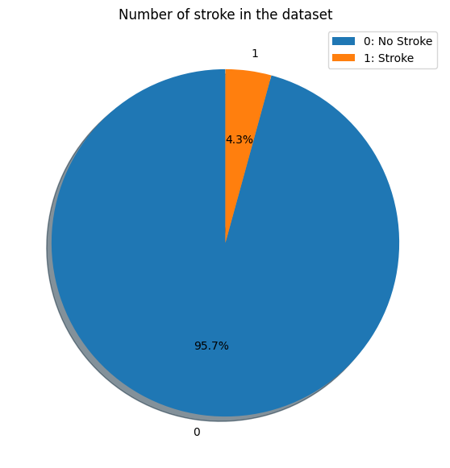
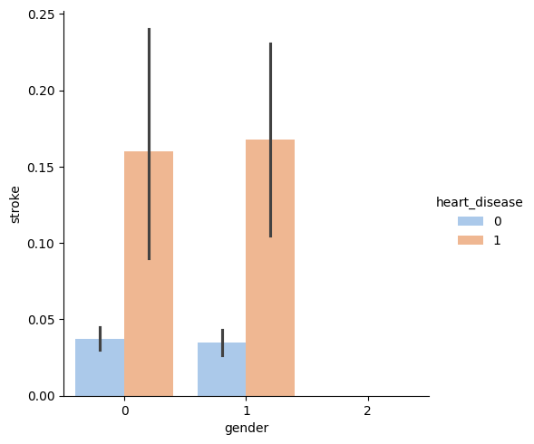
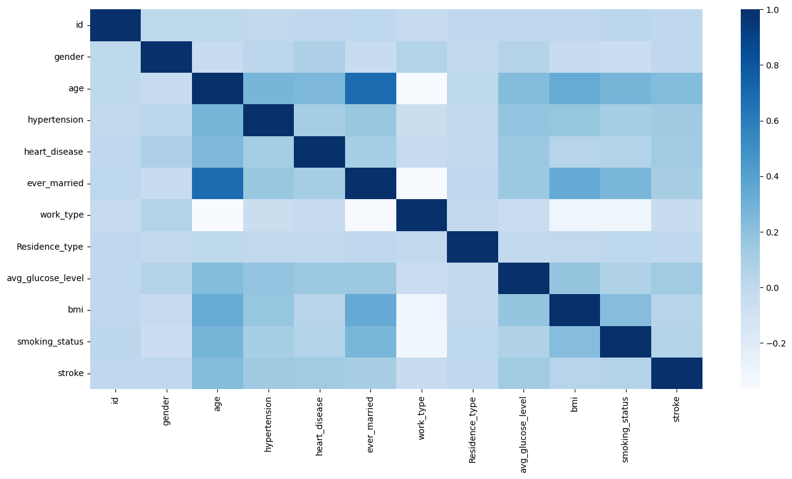

# Stroke Prediction Using Machine Learning

Machine Learning tool to predict risk of having stroke.

Repo Github: https://github.com/vnk8071/stroke-prediction

## Domain Background
According to the World Health Organization (WHO) stroke is the 2nd leading cause of death globally, responsible for approximately 11% of total deaths. It will be good if we detect and prevent this deadly disease in time, it will bring happiness to the sick and have more time to live.

## Problem Statement
Currently, classification methods using machine learning and deep learning have become popular to assist doctors in diagnosing stroke and providing timely treatment. Here, we use two models of machine learning to predict stroke based on the input parameters like gender, age, various diseases, and smoking status. The challenge of working with imbalanced datasets is that most machine learning techniques will ignore, and in turn have poor performance on, the minority class, although typically it is performance on the minority class that is most important.

## Dataset
The data collect from Kaggle: https://www.kaggle.com/fedesoriano/stroke-prediction-dataset

## Solution Statement
We use 6 models of Machine Learning (Logistic Regression, lightGBM, xgboost, Adaboost, Random Forest and Decision Tree) and compare them with each other.

The output expected: Logistic Regreesion has area under curve (82%) higher than each other.

## Analysis
### Question 1: What is the ratio of stroke patients to non-stroke patients in this dataset and it follows the same ratio in the real world?
The ratio of stroke patients to non-stroke patients in this dataset is 1:24. It is not the same ratio in the real world. The ratio of stroke patients to non-stroke patients in the real world is 1:6.

### Question 2: Is there any difference between gender and stroke?

The relationship between male and female are the same in `heart_disease` and `residence_type`. But with hypertension features, the ratio of males is greater than females.

### Question 3: What is the relationship between age and stroke?

The relationship between age and stroke is positive. The older the age, the higher the risk of stroke.

### Correlation
We can see that the correlation between `age` and `stroke` and `married` is greater than 0.7.

## Conclusion
- Dataset is imbalanced in `stroke` feature.
- The ratio of stroke patients to non-stroke patients in this dataset is 1:24. It is not the same ratio in the real world. The ratio of stroke patients to non-stroke patients in the real world is 1:6.
- The relationship between age and stroke is positive. The older the age, the higher the risk of stroke.
